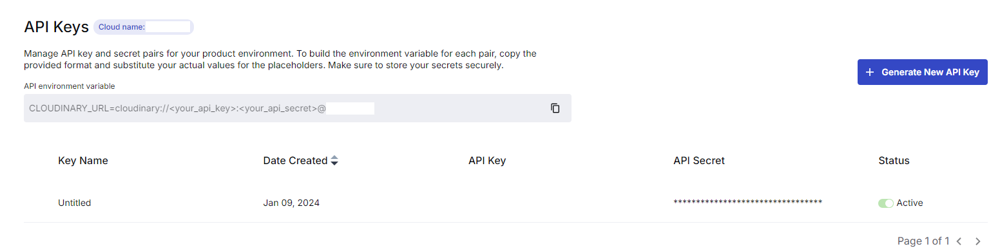

1. install multer, cloudinary, multer-storage-cloudinary

```bash
pnpm i multer cloudinary multer-storage-cloudinary
```

2. change createEvents.ejs form to add **encType="multipart/form-data"**
   and the image input to be type file instead of type text

   !!! dynamically changed input name based on the page we are on

```js
 <!-- File input for uploading an image -->
<input
  type="file"
  name="<% if(locals.updateEvent) { %>
    picture<% } else { %>photo<% } %>"
  id="image"
  class="form-control"
  <% if (locals.updateEvent) { %>
    value="<%= event.picture %>"  <!-- Prepopulate with existing picture URL if updating an event -->
  <% } %>
/>

<!-- Conditional display of image preview if 'event' data is available -->
<% if (locals.event) { %>
  <!-- Link to open modal with image preview -->
  <a
    href="javascript:void(0);"
    data-bs-toggle="modal"
    data-bs-target="#imageModal"
  >
    <!-- Display event image with click-to-enlarge functionality -->
    "
      alt="<%= event.name %>"
      class="event-img"
      style="cursor:pointer;"
    />
  </a>
<% } %>
```

3. Create cloudinary account that will give you a cloud name, a api key and an api secret



4. Add details to .env file

5. create cloudinary folder and index.js file

```js
import { v2 as cloudinary } from 'cloudinary';
import { CloudinaryStorage } from 'multer-storage-cloudinary';

// Configure Cloudinary with your credentials
cloudinary.config({
  cloud_name: process.env.CLOUDINARY_CLOUD_NAME, // Your Cloudinary cloud name
  api_key: process.env.CLOUDINARY_API_KEY, // Your Cloudinary API key
  api_secret: process.env.CLOUDINARY_API_SECRET, // Your Cloudinary API secret
});

// Configure Cloudinary storage for Multer
const storage = new CloudinaryStorage({
  cloudinary, // Pass the configured Cloudinary instance
  params: {
    folder: 'multer_test', // The folder in Cloudinary where files will be stored
    allowed_formats: ['jpg', 'png', 'webp'], // Allowed file formats for upload
  },
});

export default storage; // Export the storage configuration for use with Multer
```

6. import multer and the storage variable from index.js in the router you wish to use

```js
import multer from 'multer';
import storage from '../cloudinary/index.js';
```

direct multer to use the online storage

```js
const upload = multer({ storage });
```

7. Modify routes you wish to use to upload photos

```js
adminRouter.post(
  '/events/create',
  upload.single('photo'),
  cw(adminController.createEvent)
);

adminRouter.patch(
  '/events/:id/update',
  upload.single('picture'),
  cw(adminController.updateEvent)
);
```

8. I modified the create_tables.sql file to include picture_id field for both **user** and **event** tables

```sql
CREATE TABLE users (
    "id" INTEGER GENERATED ALWAYS AS IDENTITY PRIMARY KEY,
    "name" VARCHAR(50) NOT NULL,
    "birth_date" DATE NOT NULL,
    "description" TEXT,
    "gender" VARCHAR(10) NOT NULL,
    "picture" VARCHAR(255),
    "picture_id" VARCHAR(255),
    "email" VARCHAR(255) UNIQUE NOT NULL,
    "password" VARCHAR(255) NOT NULL,
    "status" VARCHAR(10) DEFAULT 'pending',
    "created_at" TIMESTAMPTZ NOT NULL DEFAULT NOW(),
    "updated_at" TIMESTAMPTZ
);
```

9. Also modified sequelize standalone models for both **user** and **event** to be able to create new instances of both

```js
Event.init(
  {
    id: {
      type: DataTypes.INTEGER,
      autoIncrement: true,
      primaryKey: true,
    },
    name: {
      type: DataTypes.STRING(100),
      allowNull: false,
    },
    location: {
      type: DataTypes.STRING(255),
      allowNull: false,
    },
    description: {
      type: DataTypes.STRING(255),
      allowNull: false,
    },
    picture: {
      type: DataTypes.STRING(255),
    },
    picture_id: {
      type: DataTypes.STRING(255),
    },
    date: {
      type: DataTypes.DATEONLY,
      allowNull: false,
    },
    time: {
      type: DataTypes.TIME,
      allowNull: false,
    },
    admin_id: {
      type: DataTypes.INTEGER,
      references: {
        model: 'administrators',
        key: 'id',
      },
      onDelete: 'SET NULL',
    },
    created_at: {
      type: DataTypes.DATE,
      allowNull: false,
      defaultValue: DataTypes.NOW,
    },
    updated_at: {
      type: DataTypes.DATE,
    },
  },
  {
    sequelize,
    modelName: 'Event',
    tableName: 'events',
  }
);
```

10. Modified the _createEvent_ function in the **adminController**

```js
  createEvent: async (req, res) => {
    // Check if the user is an admin
    if (req.session.admin) {
      // Extract event details from the request body
      const { name, date, location, time, hobbies, description } = req.body;

      // Extract file details from the request
      const picture = req.file.path; // Path to the uploaded image
      const picture_id = req.file.filename; // Filename for the uploaded image

      // Extract admin ID from the session
      const adminId = req.session.adminId;

      // Validate required fields
      if (!name || !date || !location || !time || !description || !adminId) {
        return res
          .status(400)
          .render('error', { error: 'Missing event data', statusCode: 400 });
      }

      // Create a new event in the database
      const newEvent = await Event.create({
        name,
        location,
        description,
        picture,
        picture_id,
        date,
        time,
        adminId,
      });

      // Check if hobbies is an array with elements
      if (Array.isArray(hobbies) && hobbies.length > 0) {
        // Map hobbies to an array of Event_hobby entries
        const hobbiesArray = hobbies.map((hobbyId) => ({
          event_id: newEvent.id,
          hobby_id: hobbyId,
        }));
        // Bulk create hobby associations
        await Event_hobby.bulkCreate(hobbiesArray);
        // Check if hobbies is a single value
      } else if (hobbies) {
        // Create a single hobby association
        const hobby = {
          event_id: newEvent.id,
          hobby_id: hobbies,
        };
        await Event_hobby.create(hobby);
      }

      // Redirect to the events page after the event creation
      return res.status(204).redirect('/admin/events');
    } else {
      // If not an admin, redirect to login page
      return res.status(401).redirect('/admin/login');
    }
  },
```

11. Modified _eventSubmitButton_ function from **script.js** in assets/js

```js
function eventSubmitButton() {
  const eventUpdateButton = document.getElementById('event-update_btn');
  const form = document.getElementById('event-form');
  if (eventUpdateButton) {
    eventUpdateButton.addEventListener('click', async (event) => {
      event.preventDefault();

      const formData = new FormData(form);

      const eventId = eventUpdateButton.getAttribute('data-event-id');

      try {
        const response = await fetch(`/admin/events/${eventId}/update`, {
          method: 'PATCH',
          body: formData,
        });
        if (response.ok) {
          window.location.href = '/admin/events'; // Redirect to events list
        } else {
          const responseData = await response.json();
          throw new Error(responseData.message || 'Failed to update event');
        }
      } catch (error) {
        console.error('Error:', error);
        alert('Failed to update event.');
      }
    });
  }
}
```

!!! Had problems all day trying to differentiate between the **POST** method used by the form and the **PATCH** method used by the fetch request in the file above. Had to modify it to send the whole formData as the body instead of JSON stringify-ing the data

12. Modified the _updateEvent_ function from the **adminController** (added a cloudinary import in order to be able to destroy the existing photo from cloudinary when uploading a new one)

```js
  // Update an event
  updateEvent: async (req, res) => {
    // Check if the user is an admin
    if (req.session.admin) {
      // Extract event details from the request body
      const { name, date, location, time, hobbies, description } = req.body;

      // Validate that all required fields are provided
      if (!name || !date || !location || !time || !description) {
        return res
          .status(400)
          .render('error', { error: 'Missing event data', statusCode: 400 });
      }

      // Find the event to update by primary key (ID), including associated hobbies
      const eventToUpdate = await Event.findByPk(req.params.id, {
        include: [
          {
            model: Hobby,
            as: 'hobbies',
          },
        ],
      });

      // Initialize picture and picture_id with existing values from the event
      let picture = eventToUpdate.picture;
      let picture_id = eventToUpdate.picture_id;

      // Check if a new file was uploaded
      if (req.file) {
        // Extract the old public ID for the image from picture_id
        const oldPublicId = picture_id;

        // Update picture path and ID with the new file details
        picture = req.file.path;
        picture_id = req.file.filename;

        // Delete the old image from Cloudinary
        await cloudinary.uploader.destroy(oldPublicId);
      }

      // Update the event record with the new details
      await eventToUpdate.update({
        name,
        location,
        description,
        picture,
        picture_id,
        date,
        time,
      });

      // Remove existing hobby associations for the event
      await Event_hobby.destroy({
        where: {
          event_id: eventToUpdate.id,
        },
      });

      // Check if hobbies is an array with elements
      if (Array.isArray(hobbies) && hobbies.length > 0) {
        // Map hobbies to an array of Event_hobby entries
        const hobbiesArray = hobbies.map((hobbyId) => ({
          event_id: eventToUpdate.id,
          hobby_id: hobbyId,
        }));
        // Bulk create hobby associations
        await Event_hobby.bulkCreate(hobbiesArray);
        // Check if hobbies is a single value
      } else if (hobbies) {
        // Create a single hobby association
        const hobby = {
          event_id: eventToUpdate.id,
          hobby_id: hobbies,
        };
        await Event_hobby.create(hobby);
      }

      // Respond with a success message and updated event data
      return res
        .status(200)
        .json({ message: 'Event modified successfully', event: eventToUpdate });
    } else {
      // If not an admin, redirect to login page
      return res.status(401).redirect('/admin/login');
    }
  },
```

13. Lastly updated the deleteEvent function to delete the photo from cloudinary when we delete the event

```js
  deleteEvent: async (req, res) => {
  if (req.session.admin) {
    const { id } = req.params;
    if (!id) {
      return res
        .status(400)
        .render('error', { error: 'Missing event id', statusCode: 400 });
    }
    const event = await Event.findByPk(id);
    const cloudinaryId = event.picture_id;
    await cloudinary.uploader.destroy(cloudinaryId);
    if (!event) {
      return res
        .status(404)
        .render('error', { error: 'Event not found', statusCode: 404 });
    }

    await event.destroy();
    res.status(204).json({ message: 'Event deleted successfully' });
  } else {
    return res.status(401).redirect('/admin/login');
  }
},
```
